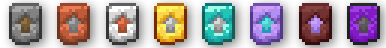

**Ascended Alloys** is an exciting Minecraft mod that expands the crafting system by introducing **copper equipment**, **amethyst equipment**, and **enderite equipment**, along with a **progressive upgrade system** similar to vanilla netherite, and a powerful new forgotten material: **enderite**.

## ⚒️ **New Equipment**
### 🪙 **Copper Equipment**
**Copper** offers enhanced durability compared to stone but is more accessible than iron. These tools provide a perfect balance for early-game players who are looking for efficiency without sacrificing valuable resources.

### 💎 **Amethyst Equipment**
As you progress, unlock the brilliance of **amethyst tools**! Combining beauty and strength, these tools are much stronger than diamond. Perfect for players seeking a touch of elegance in their crafting.

### 🌀 **Enderite Equipment**
Deep within the End lies **enderite**, a rare and mysterious mineral that surpasses even netherite in strength and versatility.

---

Use the **NEW SMITHING TEMPLATE** to upgrade your tools and armor!

---

