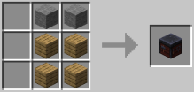
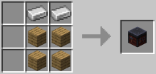
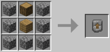
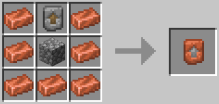
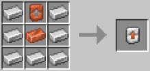
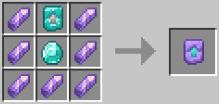
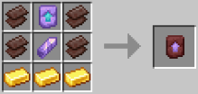
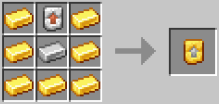

\
**Vanilla recipe for the smithing table works**

---
---

\

⚠️ You don't need a gold level to create Diamond Equipment\

**The Enderite Smithing Table can only be found inside End Cities or traded with an Armorer Villager.**

---
---

---
---

- **Small underwater ruin**\
    ↪ 25% chance for a Golden Upgrade, only one

- **Big underwater ruin**\
    ↪ 50% chance for a Golden Upgrade, one in two

- **Ruined portal**\
    ↪ 75% chance for a Golden Upgrade, one in two

- **Armorer House**\
    ↪ 25% chance for a Copper Upgrade, one in two

- **Weaponsmith House**\
    ↪ 40% chance for an Iron Upgrade, only one\
    ↪ 10% chance for a Diamond Upgrade, only one

- **Toolsmith House**\
    ↪ 40% chance for an Iron Upgrade, only one\
    ↪ 10% chance for a Diamond Upgrade, only one

- **Stronghold corridor**\
    ↪ 40% chance for a Diamond Upgrade, one in two

- **Ancient City**\
    ↪ 55% chance for a Diamond Upgrade, only one\
    ↪ 35% chance for an Amethyst Upgrade, only one

- **End City**\
    ↪ 80% chance for an Enderite Upgrade, only one\
    ↪ 10% chance for an Enderite Ingot, only one\
    ↪ 20% chance for Enderite Scrap, one in three

---
---

- **TOOLSMITH - Level 2**\
    ↪ 1 Iron upgrade for 5 emeralds

- **WEAPONSMITH - Level 2**\
    ↪ 2 Iron upgrades for 8 emeralds

- **ARMORER - Level 5**\
    ↪ 1 Enderite upgrade for 64 emeralds
